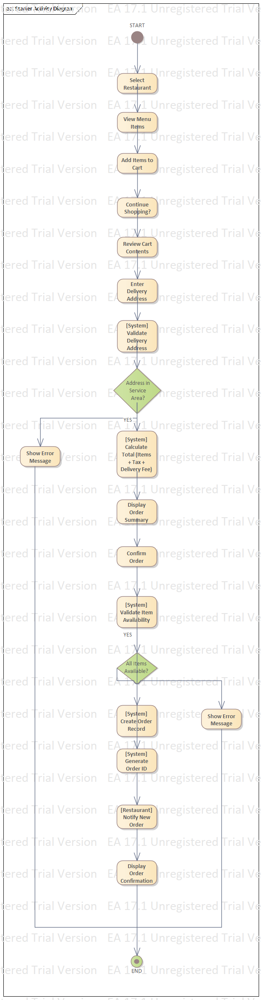
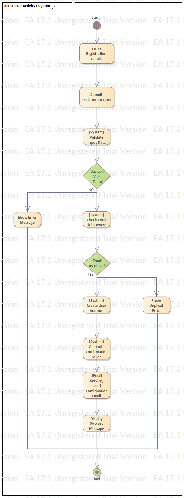

# Activity Diagrams Guide for KochaEats Food Delivery System

## Overview

Activity diagrams visualize the workflow and control flow from activity to activity. For KochaEats, we need 3-4 activity diagrams showing the step-by-step processes of key operations.

---

## Diagram 1: Customer Places Order

### **Diagram Title:** "Place Order Process"

### **Primary Actor:** Customer

### **Secondary Actors:** System, Restaurant, Payment Gateway

### **Activities Flow:**

# Activity Diagrams Guide for KochaEats Food Delivery System

## Overview

Activity diagrams visualize the workflow and control flow from activity to activity. For KochaEats, we need 3-4 activity diagrams showing the step-by-step processes of key operations.

---

## Diagram 1: Customer Places Order

### **Diagram Title:** "Place Order Process"

### **Primary Actor:** Customer

### **Secondary Actors:** System, Restaurant, Payment Gateway

### **Activities Flow:**

─────┐
│ PLACE ORDER ACTIVITY │
├─────────────────────────────────────────────────────────────┤
│ Start │
│ ↓ │
│ [Customer Logs into App] │
│ ↓ │
│ [Browse/Search Restaurants] │
│ ↓ │
│ [Select Restaurant] │
│ ↓ │
│ [View Menu Items] │
│ ↓ │
│ [Add Items to Cart] → [Update Cart Total] │
│ ↓ │
│ [Proceed to Checkout] │
│ ↓ │
├─────────────────────────────────────────────────────────────┤
│ DECISION │
│ [Is Customer Logged In?] │
├─────────────────┬───────────────────────────────────────────┤
│ No │ Yes │
│ ↓ │ ↓ │
│ [Prompt Login/ │ [Retrieve Saved Addresses] │
│ Registration] │ ↓ │
│ ↓ │ [Select Delivery Address] │
│ [Complete Login]│ ↓ │
│ ↓ │ [Enter Delivery Instructions] │
│ └────────┴─────────────────────↓─────────────────────┘
│ ↓ │
│ [Select Payment Method] │
│ ↓ │
├─────────────────────────────────────────────────────────────┤
│ DECISION │
│ [Payment Method = Online?] │
├─────────────────┬───────────────────────────────────────────┤
│ Cash │ Online │
│ ↓ │ ↓ │
│ [Confirm Order] │ [Redirect to Payment Gateway] │
│ ↓ │ ↓ │
│ │ │ [Process Payment] │
│ │ │ ↓ │
│ │ ├───────────────────────────────────────────┤
│ │ │ DECISION │
│ │ │ [Payment Successful?] │
│ │ ├─────────────────┬─────────────────────────┤
│ │ │ No │ Yes │
│ │ │ ↓ │ ↓ │
│ │ │ [Show Error] │ [Generate Order ID] │
│ │ │ ↓ │ ↓ │
│ │ │ [Retry Payment] │ [Send Confirmation] │
│ └─────────┴─────────────────┴───────────↓─────────────┘
│ ↓ │
│ [Notify Restaurant] │
│ ↓ │
│ [Display Order Summary] │
│ ↓ │
│ [Show Estimated Delivery Time] │
│ ↓ │
│ [Redirect to Order Tracking] │
│ ↓ │
│ End │
└─────────────────────────────────────────────────────────────┘

text

### **Key Decision Points:**

1. Customer authentication status
2. Payment method selection
3. Payment processing success/failure

### **Parallel Activities:**

- Cart calculation happens simultaneously with item selection
- Address validation occurs while customer enters details

---

## Diagram 2: Restaurant Processes Order

### **Diagram Title:** "Restaurant Order Processing"

### **Primary Actor:** Restaurant Staff

### **Secondary Actors:** System, Kitchen, Delivery Rider

### **Activities Flow:**

┌─────────────────────────────────────────────────────────────┐
│ RESTAURANT ORDER PROCESSING │
├─────────────────────────────────────────────────────────────┤
│ Start │
│ ↓ │
│ [Receive Order Notification] │
│ ↓ │
│ [View Order Details on Dashboard] │
│ ↓ │
├─────────────────────────────────────────────────────────────┤
│ DECISION │
│ [Can Restaurant Fulfill Order?] │
├─────────────────┬───────────────────────────────────────────┤
│ No │ Yes │
│ ↓ │ ↓ │
│ [Reject Order] │ [Accept Order] │
│ ↓ │ ↓ │
│ [Notify Customer]│ [Update Status: "Accepted"] │
│ ↓ │ ↓ │
│ [Provide Reason]│ [Send to Kitchen] │
│ ↓ │ ↓ │
│ End (Reject) │ [Prepare Food] │
│ │ ↓ │
│ ├───────────────────────────────────────────┤
│ │ DECISION │
│ │ [Preparation Completed?] │
│ ├─────────────────┬─────────────────────────┤
│ │ No │ Yes │
│ │ [Continue] │ ↓ │
│ │ ↓ │ [Quality Check] │
│ │ │ │ ↓ │
│ │ └────────┴───────────↓─────────────┘
│ │ ↓ │
│ │ [Package Order] │
│ │ ↓ │
│ │ [Update Status: "Ready for Pickup"] │
│ │ ↓ │
│ │ [Notify Rider System] │
│ │ ↓ │
│ │ [Wait for Rider Arrival] │
│ │ ↓ │
│ │ [Hand Over Order to Rider] │
│ │ ↓ │
│ │ [Confirm Handover in System] │
│ │ ↓ │
│ │ [Update Status: "Picked Up"] │
│ │ ↓ │
│ │ End │
└─────────────────────────────────────────────────────────────┘

text

### **Parallel Activities:**

- Quality check happens while food is being packaged
- Rider notification sent as soon as order is ready

---

## Diagram 3: Rider Delivery Process

### **Diagram Title:** "Food Delivery Workflow"

### **Primary Actor:** Delivery Rider

### **Secondary Actors:** System, Restaurant, Customer

### **Activities Flow:**

┌─────────────────────────────────────────────────────────────┐
│ DELIVERY WORKFLOW │
├─────────────────────────────────────────────────────────────┤
│ Start │
│ ↓ │
│ [Rider Logs into App] │
│ ↓ │
│ [Set Status: "Available"] │
│ ↓ │
│ [Receive Delivery Request] │
│ ↓ │
├─────────────────────────────────────────────────────────────┤
│ DECISION │
│ [Accept Delivery?] │
├─────────────────┬───────────────────────────────────────────┤
│ No │ Yes │
│ ↓ │ ↓ │
│ [Request Goes to│ [Update Status: "Busy"] │
│ Next Rider] │ ↓ │
│ ↓ │ [View Order & Route Details] │
│ End (for this │ ↓ │
│ rider) │ [Navigate to Restaurant] │
│ │ ↓ │
│ │ [Arrive at Restaurant] │
│ │ ↓ │
│ │ [Confirm Pickup in App] │
│ │ ↓ │
│ │ [Update Status: "Order Picked"] │
│ │ ↓ │
│ │ [Navigate to Customer] │
│ │ ↓ │
│ │ [Arrive at Customer Location] │
│ │ ↓ │
│ ├───────────────────────────────────────────┤
│ │ DECISION │
│ │ [Customer Available?] │
│ ├─────────────────┬─────────────────────────┤
│ │ No │ Yes │
│ │ ↓ │ ↓ │
│ │ [Wait/Contact] │ [Hand Over Order] │
│ │ ↓ │ ↓ │
│ │ [Max Wait Time] │ [Collect Payment if COD]
│ │ ↓ │ ↓ │
│ │ [Return to Restaurant] [Get Signature/Confirmation]
│ │ ↓ │ ↓ │
│ │ │ │ [Update Status: "Delivered"]
│ │ │ │ ↓ │
│ │ │ │ [Request Rating] │
│ │ │ │ ↓ │
│ │ │ │ [Set Status: "Available"]
│ │ └────────┴───────────↓─────────────┘
│ │ ↓ │
│ │ End │
└─────────────────────────────────────────────────────────────┘

text

### **Exception Flows:**

- Customer not available at delivery location
- Wrong address provided
- Order issues/disputes

---

## Diagram 4: Payment Processing

### **Diagram Title:** "Online Payment Processing"

### **Primary Actor:** System

### **Secondary Actors:** Customer, Payment Gateway, Bank

### **Activities Flow:**

┌─────────────────────────────────────────────────────────────┐
│ PAYMENT PROCESSING │
├─────────────────────────────────────────────────────────────┤
│ Start │
│ ↓ │
│ [Customer Selects Online Payment] │
│ ↓ │
│ [Choose Payment Method] │
│ ↓ │
├─────────────────────────────────────────────────────────────┤
│ DECISION │
│ [Payment Method Type] │
├──────────────┬──────────────┬───────────────────────────────┤
│ Card │ Mobile Money │ Digital Wallet │
│ ↓ │ ↓ │ ↓ │
│ [Enter Card] │ [Select Telco]│ [Select Wallet Provider] │
│ Details] │ ↓ │ ↓ │
│ ↓ │ [Enter Phone]│ [Authorize via App] │
│ [Validate] │ Number] │ ↓ │
│ ↓ │ ↓ │ │
│ [3D Secure] │ [Send USSD/ │ │
│ if needed] │ SMS Prompt] │ │
│ ↓ │ ↓ │ │
│ │ │ [Customer │ │
│ │ │ Confirms] │ │
│ └────────┴──────↓───────┴───────────────┘ │
│ ↓ │
│ [Encrypt Payment Data] │
│ ↓ │
│ [Send to Payment Gateway] │
│ ↓ │
│ [Gateway Processes Transaction] │
│ ↓ │
├─────────────────────────────────────────────────────────────┤
│ DECISION │
│ [Transaction Result] │
├─────────────────┬───────────────────────────────────────────┤
│ Failed │ Successful │
│ ↓ │ ↓ │
│ [Receive Error] │ [Receive Success Response] │
│ ↓ │ ↓ │
│ [Log Failure] │ [Update Order Status] │
│ ↓ │ ↓ │
│ [Notify Customer]│ [Generate Receipt] │
│ ↓ │ ↓ │
│ [Offer Retry] │ [Send Confirmation] │
│ ↓ │ ↓ │
│ │ │ [Settle with Restaurant] │
│ └──────────┴────────────────────↓──────────────────────┘
│ ↓ │
│ End │
└─────────────────────────────────────────────────────────────┘

text

---

## How to Create These Diagrams:

### **Using enterprise architecture:**

1. Go to: https://sparxsystems.com/products/ea/trial/
2. Download "Enterprise Architect Corporate Edition" (30-day trial)
3. Install with default settings
4. Launch EA and activate trial license

5. Go to: Settings → Project → General Options
6. Set Default Language: "Java"
7. Diagram Appearance:
   - Default Font: Arial, 10pt
   - Element Color Scheme: "Professional"
   - Line Style: "Simple"
8. Click "Save"

fig 2.1 

fig 2.2 

fig 2.3 

fig 2.4 
